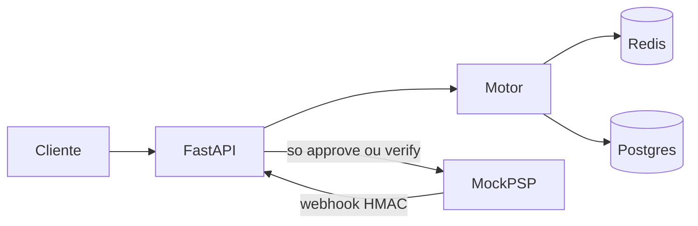

# Antifraude inline

Serviço que fica no meio do checkout. Cada tentativa recebe `approve`, `challenge` ou `deny` antes de o mock do PSP ser chamado. Só `approve` (e um `challenge` que passou no OTP) pede cobrança. O webhook que volta é tratado como entrada não confiável: HMAC, janela de tempo e id de evento.

Prazo combinado com o recrutador: entrega na segunda, 12/10/2026.

## Como ler o código

A ordem abaixo é a ordem do request.

1. [app/main.py](app/main.py) sobe Redis, Postgres, regras e o rate limit.
2. [app/api/payments.py](app/api/payments.py) é o fluxo: chave, fingerprint do cartão, reserva, score, PSP.
3. [app/engine/signals.py](app/engine/signals.py) é a fronteira entre o que o cliente afirma e o que o socket observa.
4. [app/engine/scorer.py](app/engine/scorer.py) soma os pesos do [config/rules.yml](config/rules.yml).
5. [app/storage/redis_store.py](app/storage/redis_store.py) tem a trava da idempotência, os contadores e o replay.
6. [app/api/webhooks.py](app/api/webhooks.py) autentica o webhook no corpo cru.
7. [attacks/](attacks/) mostra a defesa e, na Parte 4, o mesmo ataque na versão ingênua e na endurecida.

Comentários estão nas decisões de segurança. Sintaxe óbvia não está comentada.

## Fluxo



`challenge` não chama o PSP. O pagamento fica parado até `POST /payments/{id}/verify`. `deny` para. O mock é burro de propósito: ele não deduplica. Se deduplicasse, um gateway quebrado pareceria seguro.

## Score

Cada regra dispara o peso inteiro do YAML, ou zero. O total corta em 100.

| score | decisão |
| --- | --- |
| menor que `approve_below` (30) | `approve` |
| de 30 até 69 | `challenge` |
| `deny_at_or_above` (70) ou mais | `deny` |

| regra | peso | dispara quando |
| --- | --- | --- |
| velocity | 70 | 5 cartões distintos no IP, 8 tentativas do e-mail, ou (só no endurecido) 8 tentativas do mesmo cartão ou 12 do BIN, em 10 minutos |
| card_testing | 70 | 5 valores até R$ 10 no IP, 4 cartões distintos no BIN, ou taxa de negação do BIN em 60% com pelo menos 5 amostras |
| geo_bin | 40 | país do BIN diferente do país do IP, ou e-mail de domínio descartável |
| zscore | 40 | valor com z >= 3 contra o histórico do `customer_id`. Menos de 5 tentativas anteriores: peso zero |

Velocity e card testing, sozinhos, negam. Geo e z-score, sozinhos, desafiam. Os números estão em [config/rules.yml](config/rules.yml). País de BIN e de IP público vêm de [config/bins.csv](config/bins.csv) e [config/ip_countries.csv](config/ip_countries.csv). IP de loopback ou rede privada (a máquina local e o gateway do Docker) conta como `LAB_LOCAL_COUNTRY`, BR neste laboratório. IP desconhecido não pontua nesta regra.

O z-score usa a média e o desvio das tentativas anteriores, inclusive as negadas. Cold start não pontua. Desvio zero também não: cinco compras iguais não dão escala.

## Parte 4

Rascunho para reescrever com as suas palavras antes do envio. O avaliador vai perguntar por que você atacou isto.

As quatro brechas convivem no mesmo processo. `NAIVE_MODE=true` liga todas. Com `ALLOW_DEMO_HEADER=true`, o header `X-Naive-Controls` liga uma: `idempotency`, `challenge`, `velocity`, `signals`. Os scripts ligam o buraco, mostram o dinheiro passando, repetem sem o header e mostram a recusa. Fora do laboratório os dois interruptores ficam `false`. Header de demonstração ligado em produção é um jeito de desligar o antifraude.

### Corrida na idempotência

Dois checkouts com a mesma chave, disparados juntos. A versão ingênua lê a chave, espera, e grava sem `NX`. As duas passam e as duas chamam o mock. A endurecida usa `SET NX`: uma segue, a outra espera a resposta gravada. O script é [attacks/idempotency_race.py](attacks/idempotency_race.py). A espera de 250 ms existe para o PoC ser estável. No mundo real a janela é o intervalo entre o GET e o SET, menor, e aparece sob carga.

Fricção da correção: baixa. `SET NX` é uma ida ao Redis. O que continua aberto, e está comentado no código, é o processo morrer depois de cobrar e antes de gravar a resposta. Aí um retry pode cobrar de novo. Fechar isso de verdade é o PSP também deduplicar pela mesma chave. O mock não faz isso, para o PoC não mentir.

Não há `UNIQUE` em `idempotency_key` no Postgres. A constraint esconderia o buraco do Redis e o PoC não mostraria a segunda cobrança. Em produção eu usaria as duas travas.

### Abuso do challenge

Um BIN americano, visto da rede do laboratório (BR), cai em challenge (peso 40). Na versão ingênua, `POST /verify` aceita qualquer código e, se chamado de novo, cobra de novo. Na endurecida o OTP é HMAC, com TTL, três tentativas, comparação em tempo constante e uso único. Código errado é 401. Repetir o certo é 409. O script é [attacks/challenge_abuse.py](attacks/challenge_abuse.py).

`EXPOSE_OTP=true` devolve o código no JSON para dar para demonstrar a perna legítima. Em produção o código sai por outro canal e esse campo não existe. Deixá-lo ligado entrega o step-up a quem lê a resposta.

Fricção: o cliente verdadeiro erra o código e toma 401; na terceira, precisa de outro pagamento. É o custo de não deixar chute infinito.

### Velocity estilhaçado

O mesmo cartão, valor normal, IP e e-mail novos a cada request. A versão ingênua só olha cartões distintos por IP e tentativas por e-mail. Cada chave fica em 1, tudo aprova. A endurecida também conta o fingerprint do cartão e o BIN, sem depender do IP. O script é [attacks/velocity_shard.py](attacks/velocity_shard.py).

Isso é o que uma botnet faz de verdade, não só alguém mentindo o campo `ip`: cada saída tem um IP real, abaixo do limite, e o cartão é o mesmo. A correção pega o cartão. A fricção é o cliente legítimo no mesmo cartão, em rajada (retentativa de um checkout quebrado), tomar deny na 8ª tentativa da janela de 10 minutos. O número está no YAML de propósito, para ser afrouxado sem mexer no código.

Trocar o IP do JSON não é a mesma evasão. Isso está no item seguinte: o IP que entra no contador, no modo endurecido, é o do socket.

### Sinais forjados

O JSON manda `country=US`, um IP americano e um BIN americano. O PAN realmente começa com 400000 (EUA na tabela). O socket está na rede privada do laboratório, tratada como BR. A versão ingênua acredita no país do JSON e aprova. A endurecida ignora `country` e o IP do corpo, deriva o BIN dos 6 primeiros dígitos do PAN e desafia. E-mail `@mailinator.com` sozinho também desafia, e a versão ingênua ignora a lista. O script é [attacks/forged_signals.py](attacks/forged_signals.py).

Não leio `X-Forwarded-For`. Sem uma lista de proxies confiáveis, esse header é só mais um campo que o cliente escreve.

Fricção: atrás de CGNAT e de VPN, o país do IP erra e o cliente cai em challenge. É step-up, não deny. A tabela de IP deste laboratório é minúscula; IP desconhecido não pontua nesta regra (fail open). Em produção a tabela seria um GeoIP local, ainda assim sem confiar no país que o app do cliente enviou.

## STRIDE

- Spoofing: IP, BIN, país e e-mail no JSON; webhook sem MAC válido.
- Tampering: corpo do webhook com a assinatura anterior; valor diferente do autorizado, mesmo com MAC novo.
- Repudiation: cada decisão fica no Postgres com regra, peso e score. Não há hash chain. Dá para alterar a tabela se alguém tiver o banco.
- Information disclosure: PAN não é gravado nem logado; o laboratório ainda devolve `otp_demo` e aceita o header de demonstração.
- Denial of service: rate limit por IP do socket e TTL em toda chave do Redis. O limite está alto (300/minuto) para os scripts caberem. Produção seria menor.
- Elevation of privilege: o verify ingênuo transforma challenge em captura sem OTP, e repetido cobra de novo.

## Como rodar

Na pasta `Motor-antifraudes`:

```powershell
copy .env.example .env
docker compose up --build --wait
python -m pip install -r requirements-dev.txt
python -m pytest
python attacks/run_all.py
```

API em `http://localhost:8000`. Mock em `http://localhost:8001`. Dashboard em `http://localhost:8000/dashboard`. Saúde em `http://localhost:8000/health`. Postgres do laboratório na porta 5433 do host, para não brigar com um Postgres que já esteja na 5432. Dentro da rede do compose ele continua na 5432.

O `.env` não entra no git. Os valores do example são só deste laboratório. `PSP_HMAC_SECRET` e `PAN_PEPPER` são segredos diferentes de propósito.

Para repetir um script isolado:

```powershell
python attacks/reset_lab.py
python attacks/card_testing.py
```

`reset_lab` dá `FLUSHDB` no Redis publicado e `TRUNCATE` nas três tabelas. Não existe rota HTTP que faça isso.

Cartões são de teste (`4111111111111111` e PANs sintéticos gerados nos scripts). Não use cartão real.

### O que cada script imprime

Parte 3:

- [attacks/card_testing.py](attacks/card_testing.py) vários cartões de R$ 1,00 até o deny.
- [attacks/webhook_replay.py](attacks/webhook_replay.py) o mesmo webhook assinado, a segunda vez com 409.
- [attacks/webhook_tamper.py](attacks/webhook_tamper.py) `amount_cents` alterado com a assinatura antiga, 401.
- [attacks/double_charge.py](attacks/double_charge.py) duas chamadas seguidas, mesma chave, uma cobrança.

Parte 4, cada um na versão ingênua e de novo na endurecida:

- [attacks/idempotency_race.py](attacks/idempotency_race.py)
- [attacks/challenge_abuse.py](attacks/challenge_abuse.py)
- [attacks/velocity_shard.py](attacks/velocity_shard.py)
- [attacks/forged_signals.py](attacks/forged_signals.py)

[attacks/zscore_outlier.py](attacks/zscore_outlier.py) mostra o cold start e o outlier em challenge.

## API

`POST /payments` exige `Idempotency-Key` (8 a 200 caracteres, `[A-Za-z0-9._:-]`). Sem a chave: 400. Corpo:

```json
{
  "amount": "150.00",
  "currency": "BRL",
  "card": "4111111111111111",
  "bin": "411111",
  "customer_id": "cust_ok",
  "ip": "203.0.113.10",
  "email": "ana@example.com",
  "country": "BR"
}
```

`country` é opcional e não é sinal na versão endurecida. `amount` com no máximo 2 casas. A resposta traz `id`, `decision`, `risk_score`, `reasons` (regra, peso, detalhe) e `status`. A mesma chave com o mesmo corpo devolve a mesma resposta. A mesma chave com outro corpo: 409.

`GET /payments/{id}` devolve estado, últimos 4, os dois IPs, o BIN derivado, o BIN declarado e o histórico de decisões. Não devolve o HMAC do PAN.

`POST /payments/{id}/verify` com `{"code": "123456"}`. No laboratório o código também volta em `otp_demo` quando a decisão é challenge.

`POST /webhooks/psp` lê o corpo cru. Headers `X-PSP-Timestamp` e `X-PSP-Signature`. O MAC é HMAC-SHA256 de `timestamp + "." + corpo`, em hex. Assinatura ou timestamp inválidos: 401, com o mesmo texto. Replay do `event_id`: 409. Captura só se o pagamento está `approved` ou `verified` e o `amount_cents` é o autorizado.

O PAN é normalizado (espaço e hífen somem) antes do HMAC. Sem isso, o mesmo cartão com um espaço seria outro fingerprint. Log da aplicação passa por um redator, e o código não loga o corpo do request. Postgres guarda HMAC, últimos 4, BIN, e-mail, cliente e IPs. E-mail fica porque o controle precisa dele; o log não leva e-mail.

Chaves Redis, todas com TTL: `idempotency:{chave}`, `idempotency:{chave}:lock`, `velocity:ip:{ip}:cards`, `velocity:email:{email}`, `velocity:card:{fingerprint}`, `velocity:bin:{bin}:attempts`, `velocity:bin:{bin}:cards`, `outcomes:bin:{bin}:attempts`, `outcomes:bin:{bin}:denies`, `replay:{event_id}`, `ratelimit:{ip}`, `otp:{id}`.

## Trade-offs

- Sync de propósito. A corrida do PoC acontece no threadpool do FastAPI mais o `SET NX`. Vários workers também funcionariam, porque a trava não está na memória do processo.
- O contador de velocity não é atômico entre chaves. Duas requisições podem as duas passar um limiar por uma unidade. A trava atômica deste case é a idempotência.
- País desconhecido não pontua em geo. Fail open. Card testing e velocity continuam.
- Rate limit alto para a demonstração caber. O mecanismo está testado com teto baixo em pytest.
- Sem hash chain. Quem escreve no Postgres altera o histórico.
- O header de demonstração e o `otp_demo` são do laboratório. O boot avisa no log quando estão ligados.
- Criptografia só de `hmac`, `hashlib` e `secrets`.

## Testes

`python -m pytest` cobre MAC, replay, máscara de PAN, limiares, as quatro regras, a fronteira dos sinais forjados, `SET NX` contra a corrida ingênua, OTP de uso único e rate limit. Não sobe Docker. Os scripts em `attacks/` são o teste de ponta a ponta.

## Esteira Snyk

O workflow é [.github/workflows/snyk.yml](.github/workflows/snyk.yml). Roda em pull request e em push de `main` ou `master`. No GitHub, esta pasta tem que ser a raiz do repositório: o Actions só lê `.github/workflows` ali.

Três checks quebram o build.

| job | o que olha | quebra quando |
| --- | --- | --- |
| Open Source | `requirements.txt`, `requirements-dev.txt`, `psp_mock/requirements.txt` | high ou critical |
| Code | Python | high. Low não quebra. O HTML do dashboard o Code não analisa |
| Container | as duas imagens, com `--file` apontando o Dockerfile | high nas camadas que o Dockerfile adiciona |

`starlette` está pinado em 1.7.0 nos dois requirements. O FastAPI 0.115.12 puxava 0.41.3, com SSRF (CVE-2026-48818), ReDoS (CVE-2025-62727) e os CWE-770/706 (CVE-2026-54283, CVE-2026-54282). O fixedIn mais alto era 1.3.1. O FastAPI 0.142.2 aceita o 1.7.0. O scan de Open Source em high, depois do pin, voltou limpo. O mesmo para as dependências Python dentro das imagens.

A base `python:3.12-slim` é Debian 13. No scan de 6/10/2026 ela tinha 3 critical e 12 high, todos de pacote do SO (zlib, libstdc++, acl, attr), zero nas libs Python da imagem. A alternativa que o Snyk ofereceu foi `python:3.15-rc-alpine`, release candidate, e ainda com high. Não troco a base por um RC e não crio `.snyk` para ignorar: ignore some o achado. O job de container faz dois testes. O que quebra o PR usa `--exclude-base-image-vulns`. O outro imprime a base inteira e segue (`continue-on-error`), e o SARIF sobe se o repositório tiver code scanning. No push da branch padrão, `snyk container monitor` manda a imagem inteira para o painel, base incluída, para o alerta de quando sair patch.

Open Source força o teste legado. O CLI novo, com a flag `unified-test-api` ligada na org, chama `POST /rest/orgs/:id/tests` e devolve SNYK-CLI-0000 (`Enrichment of Test Failed`) sem apontar pacote. O job exporta `INTERNAL_SNYK_CLI_USE_UNIFIED_TEST_API_FOR_OS_CLI_TEST=false`, que volta para `/v1/test-dep-graph`, o mesmo caminho que já passou limpo no scan local. `requirements-dev.txt` leva `--package-manager=pip` porque o CLI só detecta sozinho um arquivo chamado `requirements.txt`. `snyk monitor` roda só no push da branch padrão, para cada branch não virar um projeto novo no painel.

O token é o secret `SNYK_TOKEN` do repositório (Settings, Secrets and variables, Actions). O valor é o API token da conta, em [app.snyk.io/account](https://app.snyk.io/account). Não entra no git, no `.env` nem na imagem. A org do scan é `lucasolibanker`, a mesma em que o Snyk Code foi habilitado. As actions estão pinadas por commit, não por `@master`. O upload de SARIF tem `continue-on-error`: em repositório privado sem GitHub Advanced Security esse passo falha, e quem decide o check é o exit code do Snyk. Pull request vindo de fork não recebe o secret, então o check falha até o token existir no repositório de destino.

Ficou de fora do gate, de propósito:

- IaC. `snyk iac test` não trata Dockerfile nem compose como IaC. A imagem entra no container test com `--file`.
- Snyk Secrets. O produto está desligado na org (o CLI responde SNYK-CLI-0016). Um job aqui daria 403 até alguém ligar em Settings da Snyk. O `.env` já está no `.gitignore`. Os placeholders de laboratório ficam no `.env.example`.

`NAIVE_MODE`, `ALLOW_DEMO_HEADER` e `EXPOSE_OTP` não passam por esta esteira. Ela olha dependência, código e imagem. Não sobe o compose.
